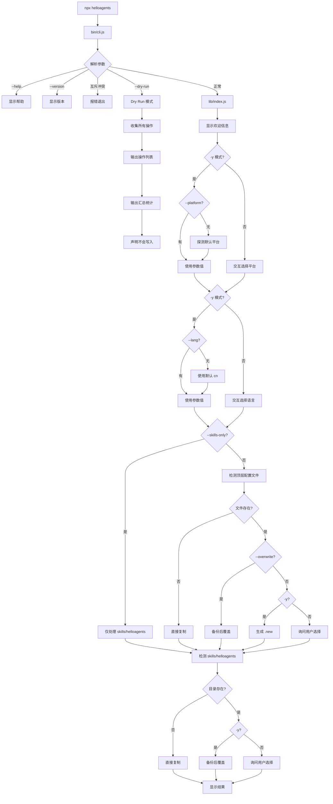

# 技术设计: npx CLI 自动配置工具

## 技术方案

### 核心技术
- **运行时:** Node.js >= 14.0.0
- **模块制式:** CommonJS（最大兼容性，避免 ESM 兼容问题）
- **依赖:** 零外部依赖（纯 Node.js 原生 API）
- **交互:** 原生 `readline` 模块
- **颜色:** ANSI 转义码（可通过 `--no-color` 或 `NO_COLOR` 环境变量禁用）
- **文件操作:** `fs/promises` + `fs`（同步用于原子操作）

### 兼容性决策

| 决策项 | 选择 | 理由 |
|--------|------|------|
| Node 版本 | >= 14.0.0 | `fs/promises` 稳定支持，覆盖绝大多数用户 |
| 模块制式 | CommonJS | 避免 ESM/CJS 兼容地狱，Node 14 完全支持 |
| 外部依赖 | 零依赖 | 降低供应链风险，避免版本兼容问题 |
| 交互方式 | 原生 readline | 朴素但稳定，数字选择 + 默认值 |
| 递归删除 | `fs.rm` + fallback | 优先 `fs.rm`，Node 14.0 fallback `fs.rmdir({recursive:true})` |

### 实现要点

1. **入口文件 (bin/cli.js)**
   - Shebang 行: `#!/usr/bin/env node`
   - 参数解析（手写，无 commander）
   - 调用主逻辑模块

2. **交互流程**
   ```
   解析参数 → 欢迎信息 → 确定平台 → 确定语言
   → 检测冲突 → [分别询问处理方式] → 执行操作 → 显示结果
   ```

3. **目标目录映射**
   | 平台 | 目标目录 |
   |------|----------|
   | Claude Code | `~/.claude/` |
   | Codex | `~/.codex/` |

4. **源文件映射**
   | 平台 | 语言 | 主配置文件 | Skills 目录 |
   |------|------|------------|-------------|
   | Claude Code | 中文 | `Claude/Skills/CN/CLAUDE.md` | `Claude/Skills/CN/skills/helloagents/` |
   | Claude Code | English | `Claude/Skills/EN/CLAUDE.md` | `Claude/Skills/EN/skills/helloagents/` |
   | Codex | 中文 | `Codex/Skills/CN/AGENTS.md` | `Codex/Skills/CN/skills/helloagents/` |
   | Codex | English | `Codex/Skills/EN/AGENTS.md` | `Codex/Skills/EN/skills/helloagents/` |

## CLI 参数设计

```
npx helloagents [options]

Options:
  --platform <claude|codex>  目标平台（跳过交互）
  --lang <cn|en>             语言版本（跳过交互）
  --yes, -y                  全部使用默认选项（非交互）
  --dry-run                  仅显示将执行的操作，不实际写入
  --skills-only              仅更新 skills/helloagents，跳过顶层配置文件
  --overwrite                强制覆盖顶层配置文件（不生成 .new）
  --no-backup                跳过备份步骤
  --no-color                 禁用 ANSI 颜色输出
  --help, -h                 显示帮助
  --version, -v              显示版本

参数互斥规则:
  --skills-only 与 --overwrite 互斥（检测到同时使用则报错退出）
```

## `-y/--yes` 行为规范

```yaml
语义: 全程非交互，自动采用默认值

platform 确定逻辑:
  1. 如提供 --platform → 使用参数值
  2. 否则自动探测:
     - 仅存在 ~/.codex → codex
     - 仅存在 ~/.claude → claude
     - 都不存在/都存在 → claude（回退默认）
  3. 输出明确打印最终选择（如 "[默认] 检测到 ~/.claude，使用 Claude Code"）

lang 确定逻辑:
  1. 如提供 --lang → 使用参数值
  2. 否则 → cn（回退默认）

冲突处理默认值:
  - CLAUDE.md/AGENTS.md → 生成 .helloagents.new
  - skills/helloagents/ → 备份后覆盖

关键约束:
  - -y 模式下不创建 readline 实例
  - 直接走默认分支，避免 CI/无 TTY 卡死
```

## 默认值探测逻辑

```javascript
// lib/defaults.js
async function detectDefaultPlatform(homeDir) {
  const claudeExists = await dirExists(path.join(homeDir, '.claude'));
  const codexExists = await dirExists(path.join(homeDir, '.codex'));

  if (codexExists && !claudeExists) {
    return { platform: 'codex', reason: '检测到 ~/.codex' };
  }
  if (claudeExists && !codexExists) {
    return { platform: 'claude', reason: '检测到 ~/.claude' };
  }
  // 都不存在或都存在 → 回退默认
  return { platform: 'claude', reason: '默认选择' };
}
```

## 冲突处理策略

### 文件级处理

| 文件类型 | 默认行为 | 交互选项 |
|----------|----------|----------|
| `CLAUDE.md` / `AGENTS.md` | 生成 `.helloagents.new` 不覆盖 | 1.生成.new(默认) 2.备份后覆盖 3.直接覆盖 4.跳过 |
| `skills/helloagents/` | 备份后覆盖 | 1.备份后覆盖(默认) 2.直接覆盖 3.跳过 |
| `skills/` 下其他目录 | **不触碰** | - |

### `.new` 文件策略

```
写入 .helloagents.new 前:
  ├─ 不存在 → 直接写入
  └─ 已存在
       ├─ 内容相同 → 跳过（输出提示"已是最新"）
       └─ 内容不同 → 改名为 .helloagents.new.backup-<timestamp> → 写入新文件
```

### 备份策略

```yaml
命名格式: <原名>.backup-<YYYYMMDD-HHmmss>
示例:
  - CLAUDE.md.backup-20260103-183000
  - skills/helloagents.backup-20260103-183000/

备份范围: 仅备份即将被覆盖的文件/目录
备份位置: 原地备份（同目录）
幂等性: 每次生成新时间戳，不覆盖旧备份
```

### 写入策略（近似原子）

```
1. 写入临时文件: <目标>.tmp-<random>
2. 校验写入完整性（文件大小/内容哈希）
3. 如需备份，先执行备份
4. rename 临时文件为目标文件
5. 失败时：保留备份，删除临时文件，输出恢复指令
```

## 依赖注入设计

为支持自动化测试，所有涉及 I/O 和时间的函数支持依赖注入：

| 注入点 | 默认实现 | 测试用途 |
|--------|----------|----------|
| `homeDir` | `os.homedir()` | 指向临时测试目录 |
| `now` | `() => new Date()` | 固定时间戳便于精确断言 |
| `getTimestamp` | 基于 `now` 生成 | 固定备份文件名 |
| `randomSuffix` | `Math.random()...` | 固定临时文件名 |
| `fs` | `require('fs').promises` | 故障注入（EACCES 等） |
| `stdout` | `process.stdout` | 捕获输出用于断言 |

**主流程函数签名:**
```javascript
async function run(options, deps = {}) {
  const {
    fs = require('fs').promises,
    homeDir = os.homedir(),
    now = () => new Date(),
    getTimestamp = () => formatTimestamp(now()),
    randomSuffix = () => Math.random().toString(36).slice(2, 8),
    stdout = process.stdout,
  } = deps;
  // ...
}
```

## 架构设计



## `--dry-run` 输出格式

```
$ npx helloagents --platform claude --lang cn --dry-run

[Dry Run] 以下操作不会实际执行：

源: Claude/Skills/CN/CLAUDE.md
  → 目标: /home/user/.claude/CLAUDE.md
  → 操作: 生成 .helloagents.new（目标已存在）

源: Claude/Skills/CN/skills/helloagents/
  → 目标: /home/user/.claude/skills/helloagents/
  → 操作: 备份后覆盖
  → 备份: skills/helloagents.backup-20260103-183000/

────────────────────────────────
汇总: 写入 1 | 备份 1 | 生成.new 1 | 跳过 0

⚠️  Dry Run 模式：不会做任何写入
```

## 失败恢复输出格式

```
❌ 复制失败: EACCES permission denied, open '/home/user/.claude/skills/helloagents/SKILL.md'

已创建的备份:
  /home/user/.claude/skills/helloagents.backup-20260103-183000/

恢复命令（如需回滚）:

# macOS/Linux
rm -rf ~/.claude/skills/helloagents
mv ~/.claude/skills/helloagents.backup-20260103-183000 ~/.claude/skills/helloagents

# Windows PowerShell
Remove-Item "$env:USERPROFILE\.claude\skills\helloagents" -Recurse -Force
Rename-Item "$env:USERPROFILE\.claude\skills\helloagents.backup-20260103-183000" "helloagents"

请修复权限问题后重新运行，或使用上述命令手动恢复。
```

## 项目结构

```
helloagents/
├── package.json          # npm 包配置（零依赖）
├── bin/
│   └── cli.js           # CLI 入口 (shebang + 参数解析)
├── lib/
│   ├── index.js         # 主流程（支持依赖注入）
│   ├── args.js          # 参数解析
│   ├── defaults.js      # 默认值探测
│   ├── prompts.js       # 交互提示（原生 readline）
│   ├── copy.js          # 文件复制（近似原子写入）
│   ├── backup.js        # 备份逻辑
│   ├── conflict.js      # 冲突检测与处理
│   ├── output.js        # 输出格式化（ANSI 颜色）
│   └── utils.js         # 工具函数（支持依赖注入）
├── test/
│   ├── run.js           # 测试入口
│   ├── helpers.js       # 测试工具
│   └── cases/           # 测试用例
├── Claude/              # Claude Code 规则集 (现有)
├── Codex/               # Codex 规则集 (现有)
└── README.md
```

## package.json 关键配置

```json
{
  "name": "helloagents",
  "version": "1.0.0",
  "description": "CLI tool to configure HelloAGENTS for Claude Code and Codex",
  "bin": {
    "helloagents": "bin/cli.js"
  },
  "files": [
    "bin/",
    "lib/",
    "Claude/",
    "Codex/"
  ],
  "scripts": {
    "test": "node test/run.js"
  },
  "engines": {
    "node": ">=14.0.0"
  },
  "keywords": ["cli", "claude", "codex", "ai", "agents"],
  "license": "Apache-2.0"
}
```

## 安全与性能

- **安全:**
  - 零外部依赖，无供应链风险
  - 不执行任何远程代码
  - 完全离线运行
  - 仅复制本地文件
  - 覆盖前询问用户确认
  - 提供备份选项保护用户数据
  - 近似原子写入避免半写入

- **性能:**
  - 使用异步文件操作
  - 零依赖，启动快
  - 规则集打包在 npm 包内，无网络请求

## 测试策略

### 自动化测试基线（本地 run.js）

- **测试框架:** 零依赖，原生 Node.js assert
- **临时目录:** `fs.mkdtemp(path.join(os.tmpdir(), 'helloagents-'))`
- **清理:** 兼容 Node 14 的 `rmrf` helper
- **依赖注入:** 固定时间戳、随机后缀、故障注入
- **端到端:** `spawn` + 10s 超时 + 显式 `--platform`/`--lang`

### CI 三平台矩阵（单独计划）

- GitHub Actions workflow
- 平台: ubuntu-latest / macos-latest / windows-latest
- Node 版本: 14 / 16 / 18 / 20

## 部署

- 发布到 npm registry
- 用户通过 `npx helloagents` 直接运行
