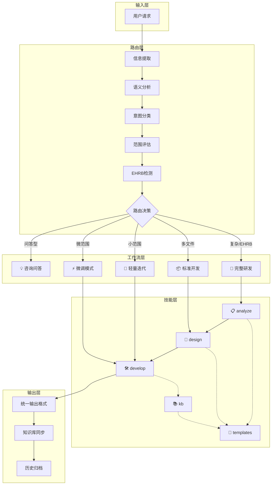
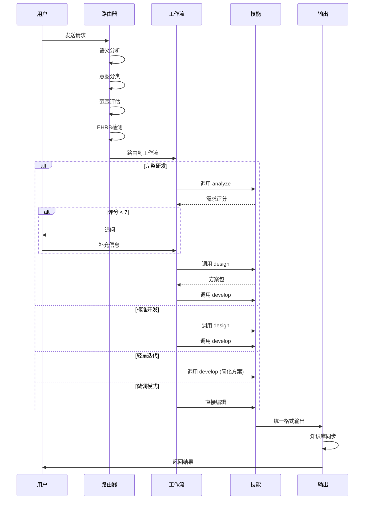

# 架构设计

## 总体架构

## 技术栈
- **规则定义:** Markdown + YAML
- **图表:** Mermaid
- **目标平台:** Codex CLI / Claude Code
- **支持系统:** Windows PowerShell / macOS / Linux

## 核心流程

### 统一智能路由流程

## 重大架构决策

完整的ADR存储在各变更的how.md中，本章节提供索引。

| adr_id | title | date | status | affected_modules | details |
|--------|-------|------|--------|------------------|---------|
| ADR-001 | 采用模块化技能架构 | 2025-12-16 | ✅已采纳 | 全部 | 将规则集拆分为5个独立技能，按需加载 |
| ADR-002 | 统一复杂度路由器 | 2025-12-16 | ✅已采纳 | core | 4种工作流通过语义分析自动选择 |
| ADR-003 | G3不确定性处理原则 | 2025-12-16 | ✅已采纳 | core | 明确披露假设，保守兜底策略 |
| ADR-004 | G12状态变量管理 | 2025-12-16 | ✅已采纳 | core, develop | 追踪方案包和模式状态 |
